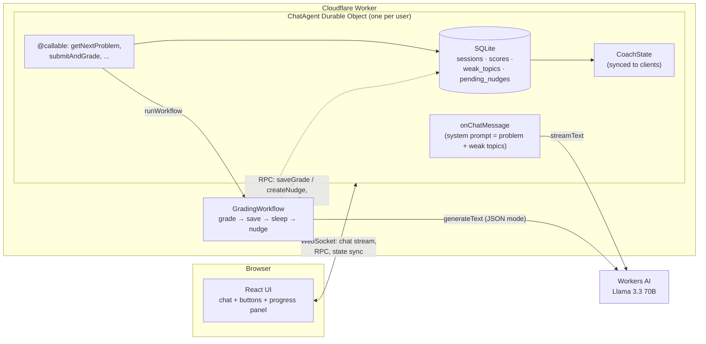

# cf_ai_interview_coach: DSA mock interview coach

An AI interviewer for data-structures-and-algorithms practice, built on Cloudflare. You get a problem, explain your approach in chat, and the interviewer (Llama 3.3 on Workers AI) asks follow-up questions and gives one hint at a time without handing over the solution. When you submit, a Cloudflare Workflow grades the conversation per topic (for example `graphs: 4/10`), updates your weak topics, and a couple of minutes later posts a revision reminder for your weakest topic. Each user has their own Durable Object with SQLite storage, so the coach remembers your scores between visits: the next problem is picked from your weakest topic, and the interviewer's system prompt tells it to probe those areas.

- **Live demo:** https://cf-ai-interview-coach.sruthirs2004.workers.dev
- **Repo:** https://github.com/R-Sruthi/cf_ai_interview_coach

Try it: **New problem** → explain your approach in the chat → **Submit & grade** → watch the progress panel update → wait about 2 minutes for the revision reminder (it appears on your next visit if you've closed the tab).

## How the assignment requirements are met

| Requirement                 | Implementation                                                                                                                                                                                                                                                                                                                      |
| --------------------------- | ----------------------------------------------------------------------------------------------------------------------------------------------------------------------------------------------------------------------------------------------------------------------------------------------------------------------------------- |
| **LLM**                     | Llama 3.3 70B (`@cf/meta/llama-3.3-70b-instruct-fp8-fast`) on Workers AI, through the AI SDK and `workers-ai-provider`. It streams the interviewer's replies in chat (`ChatAgent.onChatMessage`) and produces the structured grade (`gradeTranscript`: JSON mode with a zod schema whose keys are limited to the problem's topics). |
| **Workflow / coordination** | `GradingWorkflow` (`src/workflow.ts`), a Cloudflare Workflow started from the agent with `runWorkflow`. Steps: `grade` (3 retries, exponential backoff) → `save` (RPC back into the user's Durable Object) → `mergeAgentState` → `sleep(NUDGE_DELAY)` → `nudge`.                                                                    |
| **User input (chat)**       | React chat UI (`src/app.tsx`, adapted from the agents-starter template) over a WebSocket with `useAgentChat`, plus **New problem** and **Submit & grade** buttons that call `@callable()` agent methods.                                                                                                                            |
| **Memory / state**          | One `ChatAgent` Durable Object per user (Agents SDK `AIChatAgent`) with SQLite tables `sessions`, `scores`, `weak_topics`, `pending_nudges`, plus the persisted chat history. Agent state (`CoachState`: grading status, topic stats, last 10 sessions) syncs to the browser automatically.                                         |

## Architecture



### Traced example: submit → workflow → state sync → nudge

1. The user clicks **Submit & grade**. The browser calls `agent.stub.submitAndGrade()`, an RPC over the WebSocket.
2. `ChatAgent.submitAndGrade` checks there is an open session with at least one user message, builds a transcript of the chat since the problem was posted, sets `state.grading = { status: "grading" }` (the UI collapses the problem card and the button changes to "Grading..."), calls `runWorkflow("GRADING_WORKFLOW", { sessionId, problemId, transcript })`, and returns `{ instanceId }` straight away.
3. **`grade` step:** `gradeTranscript` asks Llama 3.3 for `{ feedback, scores: { <topic>: 0–10 } }` in JSON mode. If the output doesn't match the schema, the step throws and the Workflow retries it (up to 3 times, with exponential backoff).
4. **`save` step:** `this.agent.saveGrade(sessionId, grade)` is an RPC back into the same user's Durable Object. It writes `scores`, closes the session, recomputes `weak_topics` (per-topic `AVG(score)`/`COUNT(*)`), refreshes `CoachState.topicStats` and `history`, and adds a "Grade: …" message to the chat.
5. **`mergeAgentState`** sets `grading: { status: "done", ... }`. The state change is broadcast to every connected client, so the progress panel and the weak-topic chips in the top bar update without polling or a page refresh.
6. **`sleep`** for `NUDGE_DELAY` (2 minutes on the demo). The Workflow is durable, so it doesn't matter if the user has closed the tab or the Durable Object has been evicted.
7. **`nudge` step:** `createNudge` writes a reminder for the user's weakest topic into `pending_nudges`. If the user is connected, it is posted to the chat immediately; otherwise `onConnect` delivers it on their next visit, and `shown_at` stops it from being shown twice.
8. The next **New problem** click picks from that weakest topic, and the interviewer's system prompt lists up to 3 weak topics to probe.

## Run locally

Requires **Node 24** (`.nvmrc`) and a Cloudflare account. Workers AI has no local simulator, so `npm run dev` calls the real model through your account.

```bash
nvm use                 # Node 24
npm install
npx wrangler login      # once; or set CLOUDFLARE_API_TOKEN
npm run dev             # http://localhost:5173
```

Tests and checks:

```bash
npm run check           # oxfmt + oxlint + tsc
npm test                # unit tests: system prompt builder, formatting helpers

# Full round-trip (chat → grade → weak topics → nudge) against a dev server
# with a 10-second nudge delay instead of 2 minutes:
CLOUDFLARE_INCLUDE_PROCESS_ENV=true NUDGE_DELAY="10 seconds" npx vite dev --port 5287
node test/roundtrip.mjs localhost:5287 3 10

# The same test against the deployed worker (2-minute nudge delay):
node test/roundtrip.mjs cf-ai-interview-coach.sruthirs2004.workers.dev 3 120
```

Deploy with `npm run deploy` (`vite build && wrangler deploy`). This deploys the Worker, the `ChatAgent` Durable Object and the `grading-workflow` Workflow.

## Design decisions and findings

- **No LLM tool calling: buttons instead.** Before building, I tested Llama 3.3's tool calling (`test/tool-call.worker.ts`, 4 prompts × 5 runs). It scored 15/20 (75%). Whenever a tool was needed, it picked the right tool with valid arguments (15/15). But on a control prompt that needed no tool ("what's the time complexity of binary search?"), it called `getNextProblem` on 5 out of 5 runs. A coach that swaps your problem when you ask a question isn't usable, so `getNextProblem` and grading are deterministic `@callable()` methods triggered by UI buttons, and the chat model has no tools.
- **`workers-ai-provider` duplicated every streamed token.** Llama 3.3 stream chunks carry each token in both `response` and `choices[0].delta.content`, and the provider (3.3.1 and 4.0.0) emits both, so the UI showed "ForFor reversing reversing…". `src/ai-binding.ts` wraps the AI binding for the chat stream and drops `response` from chunks that also have `choices`. The round-trip test checks for repeated chunks and words so the bug can't come back unnoticed, and the wrapper can be removed once the provider is fixed.
- **Grading is structured and limited to the problem's topics.** The grade schema's score keys come from `z.enum(problem.topics)`, so the model can't invent topics that would then show up in `weak_topics`. Invalid output throws, and the Workflow retries the step.
- **Saves are safe to retry.** Workflow steps can run more than once. `saveGrade` returns early if the session is already closed, and `pending_nudges.session_id` is `UNIQUE` with `INSERT OR IGNORE`, so a retried step never double-counts a score or sends two nudges.
- **Clients can't write state or scores.** `validateStateChange` rejects any state update that comes from a client, and `saveGrade`/`createNudge` are public for Durable Object RPC but not `@callable`, so browsers can't call them. Scores only come from the grader.
- **One Durable Object per user, with no auth.** The browser generates a random id, keeps it in `localStorage`, and connects with `useAgent({ agent: "ChatAgent", name: id })`. That's enough for a demo, but anyone with the id can use that user's data. A real deployment would put authentication in front and derive the Durable Object name from the authenticated user.
- **`NUDGE_DELAY` is 2 minutes for the demo.** It's a `vars` entry in `wrangler.jsonc` so reviewers can see the nudge. Real spaced revision would use days (for example `"3 days"`); the Workflow's `step.sleep` works the same either way.
- **Weak topics are recomputed, not incremented.** `weak_topics` is rebuilt from all scores on every save (average and attempt count per topic). A topic is "weak" when its average is below 7/10.

## Project structure

```
src/server.ts                 ChatAgent Durable Object: SQLite schema, @callable methods, chat handler, nudges
src/workflow.ts               GradingWorkflow: grade → save → sleep → nudge
src/grading.ts                gradeTranscript: Llama 3.3 JSON-mode grading with a per-problem zod schema
src/prompt.ts                 buildSystemPrompt: interviewer rules + current problem + weak topics
src/problems.ts               25 hard-coded problems across 13 topics, with difficulty and WEAK_THRESHOLD
src/ai-binding.ts             Workaround for duplicated streaming tokens in workers-ai-provider
src/app.tsx                   React chat UI, buttons, per-user id, layout
src/components/               ProblemCard, ProgressPanel, WelcomeCard
src/format.ts                 Score/time formatting helpers
test/tool-call.worker.ts      Llama 3.3 tool-calling reliability test (separate wrangler config)
test/roundtrip.mjs            End-to-end test against a dev server or the deployed worker
test/*.test.ts                Unit tests (node --test)
wrangler.jsonc                Worker, Durable Object, Workflow, AI binding, NUDGE_DELAY
PROMPTS.md                    Every prompt used to build this with Claude Code
```

## License

MIT (from the Cloudflare agents-starter template).
